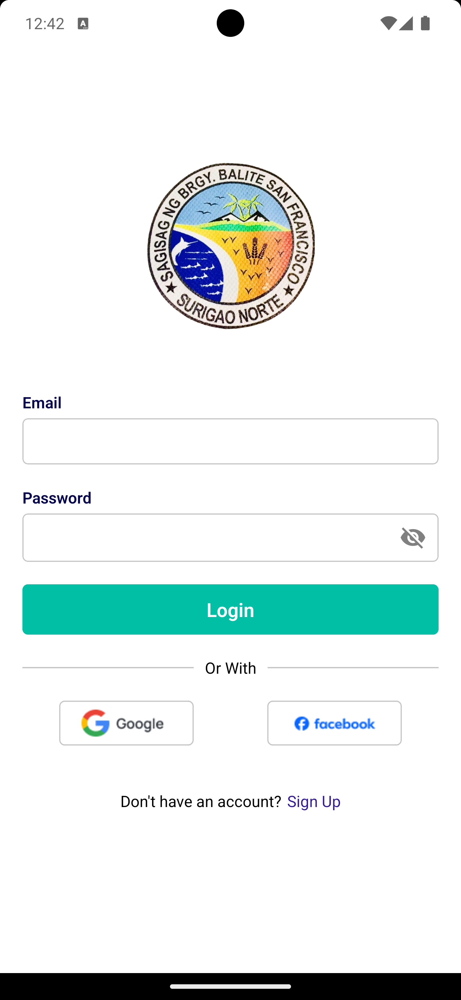
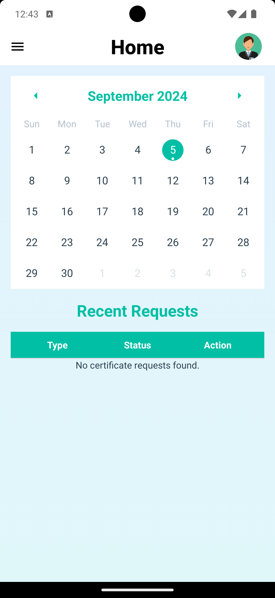
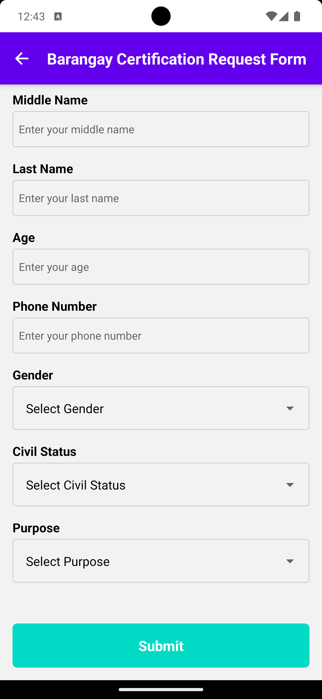
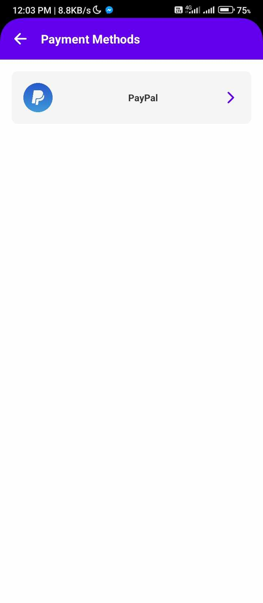
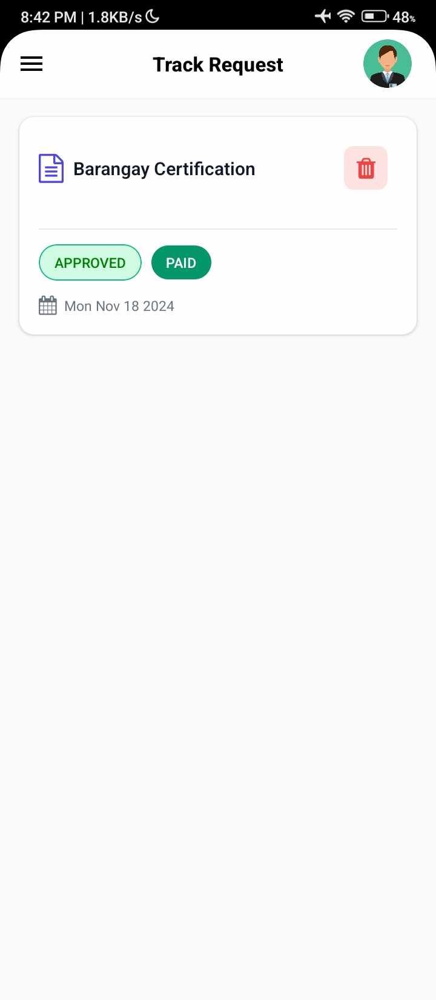
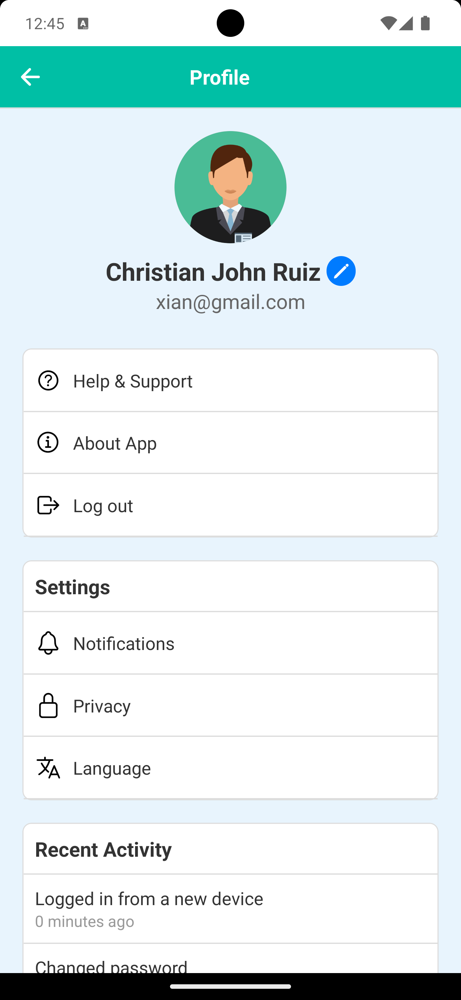

# Barangay Certification Request Mobile App

## Overview
The **Barangay Certification Request Mobile App** is a mobile application designed to streamline the process of requesting barangay certifications. Users can easily submit requests, track the status of their applications, and receive notifications once their certifications are ready.

## Features
- **User Authentication**: Secure login and registration.
- **Certification Request**: Submit requests for barangay certifications.
- **Payment Integration**: Pay for certification fees via Xendit or PayPal.
- **Real-Time Status Updates**: Track the progress of certification requests.
- **Notifications**: Receive alerts for updates and approvals.
- **Profile Management**: Update user information and request history.

## Technologies Used
- **Frontend**: React Native (Expo)
- **Backend**: Firebase (Authentication, Firestore Database, Cloud Functions)
- **Payment Gateway**: Xendit, PayPal
- **Notifications**: Firebase Cloud Messaging (FCM)

## Installation & Setup
1. Clone the repository:
   
sh
   git clone https://github.com/Xian395/Barangay_Certification_Request_MobileApp.git
   cd Barangay_Certification_Request_MobileApp

2. Install dependencies:
   
sh
   npm install

3. Set up Firebase:
   - Create a Firebase project.
   - Add your google-services.json (Android) and GoogleService-Info.plist (iOS).
   - Configure Firestore and Authentication.
4. Run the application:
   
sh
   expo start

## Usage
- **Login/Register**: Create an account or log in.
- **Request Certification**: Fill out the request form and submit.
- **Make Payment**: Complete the transaction via the available payment options.
- **Track Status**: View the progress of your request in real-time.

## UI Preview
Here are some screenshots of the app in action:

<table>
  <tr>
    <td align="center"><strong>Login Screen</strong></td>
    <td align="center"><strong>Home Screen</strong></td>
    <td align="center"><strong>Request Form</strong></td>
  </tr>
  <tr>
    <td></td>
    <td></td>
    <td></td>
  </tr>
  <tr>
    <td align="center"><strong>Payment Options</strong></td>
    <td align="center"><strong>Status Tracking</strong></td>
    <td align="center"><strong>Profile Management</strong></td>
  </tr>
  <tr>
    <td></td>
    <td></td>
    <td></td>
  </tr>
</table>

## License
This project is licensed under the **MIT License**.

## Contact
For any inquiries or support, contact:
📧 Email: christianjohnruiz395@gmail.com
📌 GitHub: [Xian395](https://github.com/Xian395)

---
🚀 **Empowering Barangays with Digital Solutions!**
